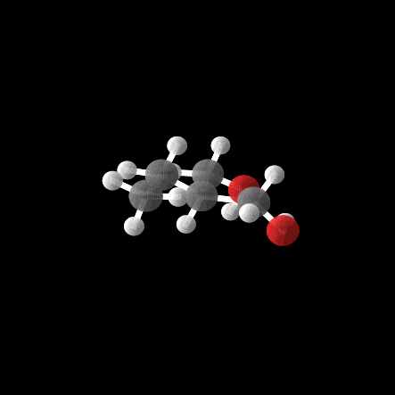

# E(3) Equivariant Diffusion Model for 3D Molecule Generation



This repository is a fork of the original implementation of [E(3) Equivariant Diffusion for Molecule Generation](https://github.com/ehoogeboom/e3_diffusion_for_molecules/tree/main). The approach, as introduced in the [original paper](https://arxiv.org/abs/2203.17003), extends diffusion models to 3D molecular structures while preserving E(3) equivariance.

In this fork, we've introduced additional features for conditional molecule generation:

* Users can now specify target property values for controlled molecule generation.
* This implementation supports extrapolation, allowing users to explore molecules specifically generated to match property values outside the training range

### Training the EDM:

```python main_qm9.py --n_epochs 3000 --exp_name edm_qm9 --n_stability_samples 1000 --diffusion_noise_schedule polynomial_2 --diffusion_noise_precision 1e-5 --diffusion_steps 1000 --diffusion_loss_type l2 --batch_size 64 --nf 256 --n_layers 9 --lr 1e-4 --normalize_factors [1,4,10] --test_epochs 20 --ema_decay 0.9999```


### For Conditional Generation of QM9

#### Train a Conditional EDM
To train a conditional EDM, run:
```python main_qm9.py --exp_name exp_cond_alpha  --model egnn_dynamics --lr 1e-4  --nf 192 --n_layers 9 --save_model True --diffusion_steps 1000 --sin_embedding False --n_epochs 3000 --n_stability_samples 500 --diffusion_noise_schedule polynomial_2 --diffusion_noise_precision 1e-5 --dequantization deterministic --include_charges False --diffusion_loss_type l2 --batch_size 64 --normalize_factors [1,8,1] --conditioning alpha --dataset qm9_second_half```

The argument `--conditioning alpha` can be set to any of the following properties: `alpha`, `gap`, `homo`, `lumo`, `mu` `Cv`. The same applies to the following commands that also depend on alpha.

#### Generate samples for different property values
To generate samples conditioned on a property, use:
```python eval_conditional_qm9.py --generators_path outputs/exp_cond_alpha --property alpha --n_sweeps 10 --task qualitative```

You can also use the pre-trained model on alpha provided by the authors by setting `--generators_path` to `outputs/exp_35_conditional_nf192_9l_alpha` 

These arguments help control the generation process:
--threshold_type: Specifies the type of threshold for conditional generation. Options are:

abs_val: Use an absolute threshold value.
percentage: Use a percentage-based threshold.
None: No threshold is applied.
--threshold: A float value specifying the threshold for conditional generation. (Default: None)

--sampling_type: Determines the sampling approach for conditional generation. Options are:

interpolation: Generate molecules within the training range of properties.
extrapolation: Generate molecules with property values outside the training range.

#### Examples
To explore molecules with property values in the top 10% of the training distribution, run:
```python eval_conditional_qm9.py --generators_path outputs/exp_35_conditional_nf192_9l_alpha --property alpha --n_sweeps 1 --task qualitative --threshold_type percentage --threshold 0.1 --sampling_type interpolation```

To extrapolate and generate molecules with property values outside the training range, use:
```python eval_conditional_qm9.py --generators_path outputs/exp_35_conditional_nf192_9l_alpha --property alpha --n_sweeps 1 --task qualitative --threshold_type abs_val --threshold 0.1 --sampling_type extrapolation```


